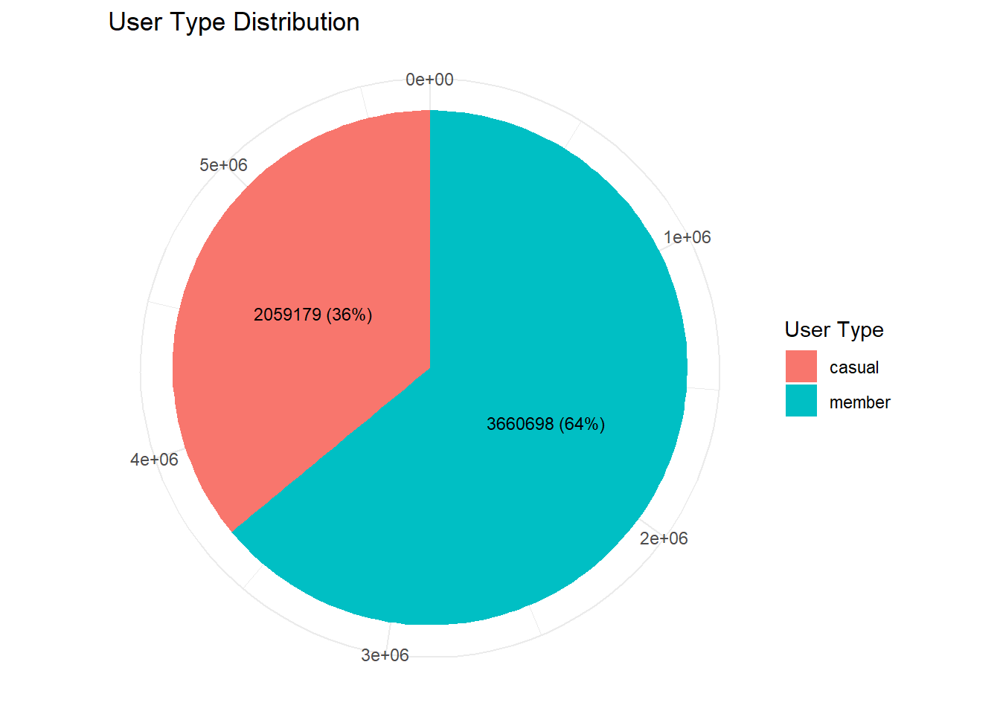

# Cyclistic Analysis

The Google Data Analytics Capstone case study number 1 named: "[How does a bike share company reach a speedy success]{.underline}". Created by [**Mohammed Derouiche**](https://www.linkedin.com/in/mohammed-derouiche-8958b425a), a Junior Data Analyst from Algeria.

{width="700"}

## Project Overview

This analysis delves into the operations and performance metrics of Cyclistic, a fictional bike-sharing company based in Chicago. Leveraging data from the years 2020 to 2023, the project aims to provide actionable insights and recommendations to optimize business strategies and enhance customer experience. By exploring various facets such as user behavior, bike usage patterns, and seasonal trends, the analysis seeks to uncover key drivers of success and opportunities for growth.

## Methodology

The analysis primarily utilizes the R programming language, along with popular libraries such as ggplot2 and tidyverse. Data preprocessing, cleaning, and transformation techniques are applied to ensure the reliability and accuracy of insights derived from the datasets. Exploratory data analysis (EDA) techniques, including visualization and statistical analysis, are utilized to uncover trends, patterns, and correlations within the data.

## Key Insights

**User Segmentation:** The analysis identifies distinct user segments, namely annual members and casual users, each exhibiting unique usage patterns and preferences. Annual members contribute significantly more to total trip counts (64%) compared to casual users, highlighting the importance of catering to their specific needs and preferences.

**Bike Usage Patterns:** Both user segments display preferences for different types of bikes, with casual users favoring classic bikes for longer-duration rides and annual members opting for electric bikes for longer-distance journeys. This suggests opportunities for targeted bike fleet optimization and marketing strategies tailored to each user segment.

**Seasonal Trends:** Seasonal variations in bike usage are observed, with peak usage during late spring and summer months and a decline during winter. Marketing campaigns and promotional offers aligned with seasonal preferences can help maximize user engagement and capitalize on peak demand periods.

**Recommendations Membership Incentives:** Implement promotional discounts and loyalty programs to incentivize casual users to convert into annual members, thereby increasing overall membership and trip counts.

**Bike Fleet Optimization:** Adjust the bike fleet composition to cater to the preferences of different user segments, ensuring availability of preferred bike types during peak usage hours.

**Seasonal Campaigns:** Launch targeted marketing campaigns and promotions aligned with seasonal trends to capitalize on peak demand periods and drive user engagement.

**User Experience Enhancement:** Develop user-centric initiatives such as weekend events, winter maintenance programs, and specialized services to enhance customer experience and satisfaction.

## Note

There is a missing folder named Subset_2023 that contains 12 csv files for all datasets in 2023. I didn't commit this folder due to its large size (about 1 GB), but you can download the recommended files from the this [link](https://divvy-tripdata.s3.amazonaws.com/index.html) and put them in a similar folder name "Subset_2023" (download only the 202301 to 202312 csv files).
